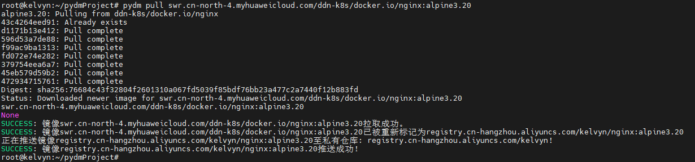
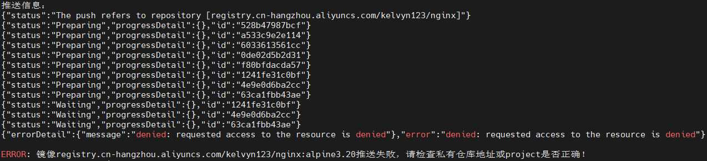
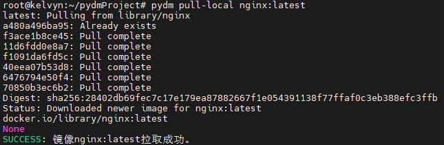

# pyDockerMirror 容器镜像转存工具

## 支持范围
建议使用Python3.7+，以下版本没有经过验证。
理论上凡是支持Docker登录、pull、push的私有仓库均适用。

## TODO
- [ ] 批量镜像拉取及推送

*PS: 其实我认为目前功能已经够用了，上边功能哪天闲下来再加吧。*

针对目前DockerHub官方被Ban的情况下，可以通过配置`/etc/docker/daemon.json`配置镜像加速器。

下面是我的配置：
```json
{
        "registry-mirrors": [
            "https://docker.1panel.dev",
            "https://dockerproxy.net"
        ]
}
```

配置完成后，需要执行以下两个命令以生效：
```bash
systemctl daemon-reload
systemctl restart docker.service
```

## 编译

* 二进制文件下载地址

```bash
wget https://github.com/ivmoe/pyDockerMirror/releases/download/v1.0.0/pyDockerMirror.tar.gz
```

* 源码编译

```bash
# 安装python依赖库 pyinstaller、docker
pip3 install pyinstaller docker
# 下载仓库代码
git clone 

# 进入仓库目录
cd pyDockerMirror

# 编译，生成二进制文件，生成的二进制文件在dist目录下
pyinstaller -F pydm.py
```

## 使用说明

* 添加执行权限，并拷贝至`/usr/local/bin`目录下

```bash
chmod +x pydm && cp pydm /usr/local/bin
```

* 查看帮助信息

```bash
pydm help
```

* 配置初始化

**privateRegistry 域名:** 填写私有仓库域名，可以是harbor或者阿里云镜像仓库

**privateRegistry 用户名：** 填写账号，具有pull和push权限

**privateRegistry 密码：** 填写密码

**privateRegistry 项目：** 填写项目（仓库）名称，默认为public

**示例：**

* 镜像同步到私有仓库

拉取镜像到本地，重新Tag后推送镜像到私有仓库。

```bash
pydm pull <镜像名称>
```


project没有写对的话，报错如下：



* 镜像拉取至本地

仅拉取到本地，不上传至私有仓库，不修改镜像Tag

```bash
pydm pull-local <镜像名称>
```



* 配置管理

在执行`pydm init`初始化后，会生成配置文件`/etc/pydm/config`，存储相关信息。

```bash
privateRegistry:
  domain: registry.cn-hangzhou.aliyuncs.com
  username: ******
  password: ******
  project: kelvyn
```